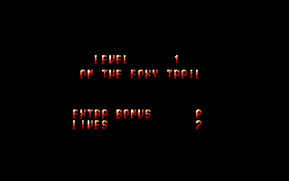
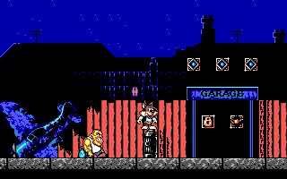

# TITUS-THE-FOX-SQZ-COMP-DECOMP
Decompressor and compressor for Titus the Fox (MSDOS). Probably works on Prehistorik and Prehistorik II.

Two python scripts created with claude:
- patch_palette: changes EGA palette on EXE file, to make EGA version look better.
- python_sqz_lzw: compress/decompress SQZ files. BMP to SQZ; SQZ to bmp; BIN to SQZ; SQZ to BIN;

Inyected custom title (TITREEGA.SQZ):

Patched EXE (custom EGA palette):

